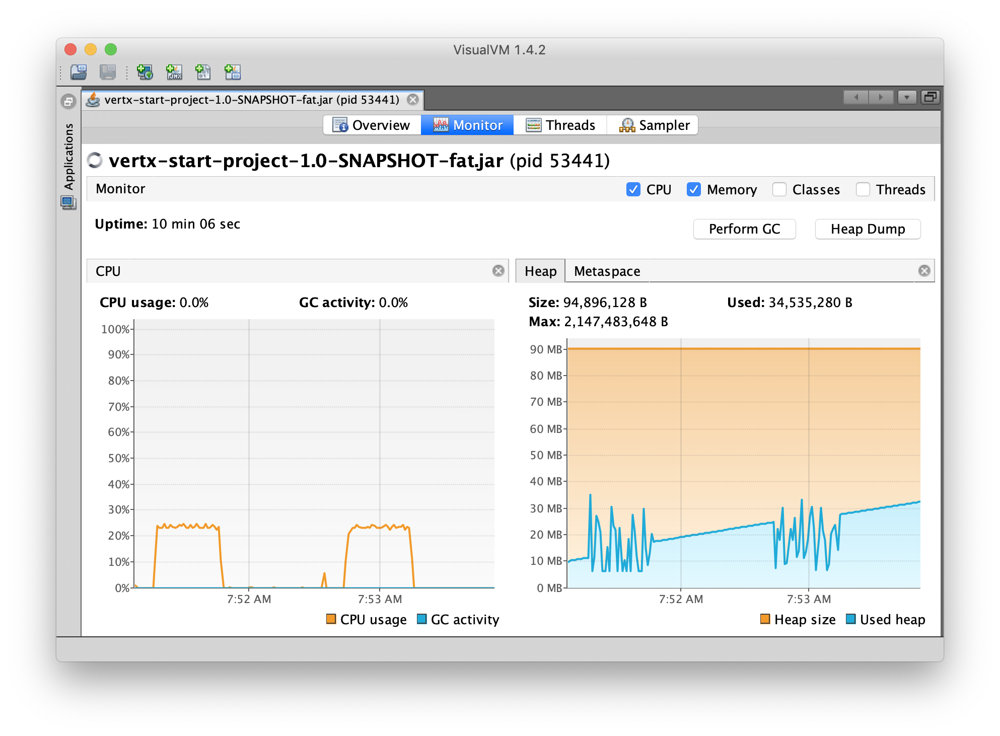

# Learn Vert.x


[Vert.x](https://vertx.io/) is a polyglot event-driven application framework that runs on the Java Virtual Machine.

- [Vert.x Documentation](https://vertx.io/docs/)
- [Vert.x Examples](https://github.com/vert-x3/vertx-examples/)
- [Web Framework Benchmarks](https://www.techempower.com/benchmarks/#section=data-r8&hw=ph&test=plaintext)
- [ทำความรู้จักกับ Vert.x Tool-kit for building reactive applications on the JVM](https://cyl3erpunkz.wordpress.com/2015/07/04/get-started-vertx/)
- [สร้าง Reactive RESTful Web Service ด้วย Vert.x](https://link.medium.com/B2As0rPAxX)

## Try

	mvn compile exec:java

The command compiles the project and runs the tests, then it launches the application, so you can check by yourself. Open your browser to http://localhost:8080. You should see a Hello World message.

## Or Build

	mvn clean package -Dmaven.test.skip
	java -jar target/vertx-start-project-1.0-SNAPSHOT-fat.jar

## Testing

Use [http](https://httpie.org/) command for request `GET` http://localhost:8080/

	$ http :8080/

```
HTTP/1.1 200 OK
content-length: 12
content-type: text/html

Hello Vert.x
```

Use [REST Client for VS Code](https://marketplace.visualstudio.com/items?itemName=humao.rest-client) for test request

see file `request.http`

	@host = http://localhost:8080

	###

	POST {{host}}/customers HTTP/1.1
	Content-Type: application/json

	{
		"id": 0,
		"firstName": "Somchai",
		"lastName": "Jaidee",
		"age": 20,
		"email": "somchai.jaidee@mail.com"
	}

	###

	GET {{host}}/customers HTTP/1.1


Use [wrk](https://github.com/wg/wrk) for benchmarking

    $ wrk -c100 -d30s -t4 http://localhost:8080/

```
Running 30s test @ http://localhost:8080/
  4 threads and 100 connections
  Thread Stats   Avg      Stdev     Max   +/- Stdev
    Latency     1.59ms  566.11us  29.26ms   92.06%
    Req/Sec    15.84k     1.56k   23.28k    78.14%
  1895830 requests in 30.10s, 137.41MB read
Requests/sec:  62974.93
Transfer/sec:      4.56MB
```

Use [VisualVM](https://visualvm.github.io/) for monitor CPU and Memory usage


